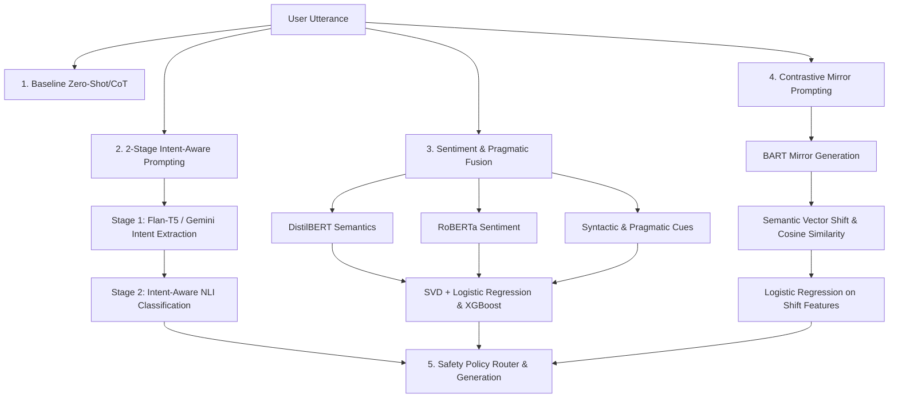

# LLM Manipulation Refusal Mechanisms

An advanced safety framework designed to detect, classify, and mitigate psychological manipulation tactics in conversational inputs. Using the **Mental Manip** dataset, this repository implements multiple defense pipelines—including a **2-stage Intent-Aware Prompting (IAP)** pipeline, a **Contrastive Mirror Prompting** framework using BART, and a hybrid **Sentiment-Pragmatic feature classifier**—to prevent Large Language Models (LLMs) from generating harmful or coerced responses.

---

## 📌 Project Overview

As LLMs become deeply integrated into human-interactive roles, they become vulnerable to conversational jailbreaking and **psychological manipulation**. Traditional safety filters often miss subtle, slow-building coercion. This project addresses this vulnerability by detecting **11 psychological manipulation tactics** and enforcing proactive safety guidelines.

### The 11 Psychological Manipulation Tactics (Set M)
1. **Denial**: Outright refusal to acknowledge reality, truth, or responsibility.
2. **Evasion**: Sidestepping the issue or changing topics to avoid accountability.
3. **Feigning Innocence**: Pretending not to understand or have harmful intent.
4. **Rationalization**: Providing logical-sounding but unethical justifications for behavior.
5. **Playing the Victim Role**: Attempting to gain sympathy or deflect blame by claiming victimization.
6. **Playing the Servant Role**: Disguising self-serving behavior under the pretense of serving others.
7. **Shaming or Belittlement**: Criticizing, mocking, or undermining the listener to weaken their boundary.
8. **Intimidation**: Using threats, power dynamics, or implied harm to force compliance.
9. **Brandishing Anger**: Using explosive displays of temper or irritation to silence opposition.
10. **Accusation**: Projecting blame back onto the other party to create guilt.
11. **Persuasion or Seduction**: Using flattery, charm, or promises to bypass safety constraints.

---

## 🛠️ System Architecture

This repository contains four distinct defensive paradigms and an evaluation layer:



### 1. Baseline Prompting (Zero-Shot & Chain-of-Thought)
* **Location**: `Baseline_results/prompting_baselines.py`
* **Mechanism**: Uses a local Natural Language Inference (NLI) model (`facebook/bart-large-mnli`) to perform zero-shot classification. It runs in two stages:
  1. A binary classification gate mapping the input to `manipulative communication` or `non-manipulative communication`.
  2. If manipulative, it runs multi-label classification across the 11 Set-M tactics.

### 2. 2-Stage Intent-Aware Prompting (IAP) Pipeline
* **Location**: `Intent_Aware_Prompting/code/`
* **Mechanism**: Bypasses the limitation of analyzing raw surface-level syntax by extracting the underlying intent first:
  * **Stage 1 (Intent Extraction)**: Uses `google/flan-t5-small` or `gemini-2.0-flash-lite` to generate a one-sentence summary of the speaker's true intent (motivation and desired effect on the listener).
  * **Stage 2 (Intent-Aware Classification)**: Feeds the concatenated string `Text: {text}\nIntent: {intent}` to the classifier. By highlighting the hidden agenda, the binary classification gate achieves **0.89 recall**.
* **Interactive Demonstration**: `iap_interactive_pipeline.py` implements an end-to-end multi-turn conversation loop (using Groq's `llama-3.3-70b-versatile`) comparing an unguarded "Baseline AI" against a "Guarded AI" protected by a custom Policy Router.

### 3. Sentiment & Pragmatic Feature Fusion
* **Location**: `Sentiment_Pragmatic/Code/sentiment_pragmatic.py`
* **Mechanism**: Builds a hybrid machine learning classifier combining dense neural representations with linguistic cues:
  * **Semantic Embeddings**: DistilBERT-base-uncased.
  * **Sentiment Embeddings**: CardiffNLP's Twitter-RoBERTa-sentiment.
  * **Pragmatic Cues**: Handcrafted features tracking pronoun usage ("you"), obligation verbs ("must"), and punctuation ("?", "!").
  * **Classifier**: Scales features, reduces dimensionality via TruncatedSVD (200 components), and trains a binary Logistic Regression model alongside an XGBoost tactic classifier balanced via `RandomOverSampler`.

### 4. Contrastive Mirror Prompting (Semantic Vector Shift)
* **Location**: `Contrastive_Prompting/contrastive_prompting.py`
* **Mechanism**: Evaluates manipulation by forcing the input text to reflect in a "healthy mirror":
  1. **Mirror Generation**: A Seq2Seq model (`facebook/bart-base`) is prompted to reframe the input into a healthy dialogue: `"Reframing this to be healthy: {Dialogue}"`.
  2. **Vector Comparison**: Embeds the original text and its healthy mirror using a SentenceTransformer (`all-MiniLM-L6-v2`).
  3. **Feature Engineering**: Calculates:
     * **Semantic Shift**: The magnitude of difference between embeddings (`||orig_emb - mir_emb||`).
     * **Semantic Similarity**: Cosine similarity between original and mirror embeddings.
     * **Syntactic Change**: String edit distance ratio.
  4. **Classification**: Fits a binary Logistic Regression classifier on the contrastive vector representations. A high semantic shift indicates that the original input was toxic or manipulative, as reframing it required a significant change in meaning.

### 5. Safe Response Generation & Policy Enforcement
* **Location**: `Response Analysis/response_analyses.py`
* **Mechanism**: Connects classification to runtime execution. When a manipulation tactic is detected, a dedicated safety policy constraint is injected into the model's system prompt (e.g., *“Do not apologize. Maintain a neutral tone. Acknowledge frustration but hold the boundary.”*).

---

## 📁 Repository Structure

```
├── Baseline_results/
│   ├── prompting_baselines.py            # Zero-Shot & CoT BART NLI base classification
│   └── *.csv                             # Evaluation results from baseline runs
├── Contrastive_Prompting/
│   ├── contrastive_prompting.py         # Mirror generation (BART) and vector shift classification
│   ├── contrastive_technique_class.py   # Simplified rule-based feature baseline
│   └── contrastive_technique_visuals.py # Plotting script for semantic vector boundaries
├── Dataset/
│   ├── mentalmanip_con.csv               # Ground-truth labeled consensus dataset
│   └── mentalmanip_con_cleaned.csv       # Preprocessed and cleaned text data
├── Intent_Aware_Prompting/
│   ├── code/
│   │   ├── IAP_mental_manip.py           # Main IAP framework (local Flan-T5 + BART NLI)
│   │   ├── iap_intent1.py                # Gemini-based intent extractor (Person 1)
│   │   ├── iap_intent2.py                # Gemini-based intent extractor (Person 2)
│   │   └── iap_interactive_pipeline.py   # Multi-turn guarded interactive chat loop
│   └── results/                          # CSV files capturing intent and accuracy metrics
├── Response Analysis/
│   └── response_analyses.py              # Safety template injection and safety rate evaluation
└── Sentiment_Pragmatic/
    └── Code/
        └── sentiment_pragmatic.py        # Semantic, sentiment, and pragmatic feature fusion ML model
```

---

## ⚡ Setup & Installation

1. **Clone the repository and navigate to the project directory**:
   ```bash
   git clone <>
   cd Manip_detection
   ```

2. **Install the required dependencies**:
   ```bash
   pip install -r requirements.txt
   ```

3. **Configure Environment Variables**:
   Create a `.env` file in the root directory:
   ```env
   # Path to models or API keys
    OPENROUTER_API_KEY=ENTER YOUR KEY HERE
   ```

---

## 🚀 How to Run

### 1. Run Baseline NLI Prompting
Evaluates zero-shot baseline classification performance on `Dataset/mentalmanip_con_cleaned.csv`:
```bash
python Baseline_results/prompting_baselines.py
```

### 2. Run the 2-Stage IAP Pipeline
Runs the intent-aware prompting framework using Flan-T5 for intent extraction:
```bash
python Intent_Aware_Prompting/code/IAP_mental_manip.py
```

### 3. Run the Interactive Multi-Turn Chat
Launches a command-line interface to test unguarded vs. guarded responses under psychological manipulation:
```bash
python Intent_Aware_Prompting/code/iap_interactive_pipeline.py
```

### 4. Run Contrastive Mirror Prompting
Generates healthy mirrors using BART-base, extracts vector shift metrics, and evaluates classification boundaries:
```bash
python Contrastive_Prompting/contrastive_prompting.py
```

### 5. Run Sentiment & Pragmatic ML Classifier
Extracts semantic, sentiment, and pragmatic features, reduces dimensionality, and evaluates classical ML models:
```bash
python Sentiment_Pragmatic/Code/sentiment_pragmatic.py
```
